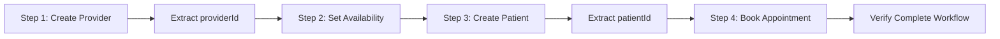

# Healthcare API Testing Framework

A comprehensive Playwright-based TypeScript framework for testing Healthcare APIs with complete workflow automation.

## 🏗️ Framework Structure

```
ApiCode/
├── tests/
│   └── test-complete-workflow.ts    # Main 4-step workflow test
├── package.json                     # Dependencies and scripts
├── playwright.config.ts             # Playwright configuration
├── tsconfig.json                   # TypeScript configuration
└── README.md                       # This file
```

## 🚀 Quick Start

### Prerequisites
- Node.js (v16 or higher)
- npm or yarn

### Installation
```bash
cd C:\Chadcredentials\ApiCode
npm install
npm run install:playwright
```

### Run Tests
```bash
# Run the complete workflow test
npm test

# Run with UI mode
npm run test:ui

# Run in headed mode (see browser)
npm run test:headed

# Debug mode
npm run test:debug

# View test report
npm run report
```

## 🔄 Complete 4-Step Workflow

The framework executes a complete healthcare API workflow:

### Step 1: Create Provider
- **Endpoint**: `POST /api/master/provider`
- **Creates**: Provider "sanjana parmar"
- **Extracts**: `providerId` for next steps
- **Validation**: Status 200/201, providerId extraction

### Step 2: Set Provider Availability
- **Endpoint**: `POST /api/master/provider/availability-setting`
- **Uses**: Dynamic `providerId` from Step 1
- **Sets**: Monday-Friday, 12:00-13:00 EST, Virtual mode
- **Validation**: Status 200/201, providerId verification

### Step 3: Create Patient
- **Endpoint**: `POST /api/master/patient`
- **Creates**: Patient "Aricana rodriguess"
- **Extracts**: `patientId` for Step 4
- **Validation**: Status 200/201, patient details verification

### Step 4: Book Appointment
- **Endpoint**: `POST /api/master/appointment`
- **Uses**: Dynamic `providerId` and `patientId`
- **Books**: Virtual appointment for 2025-08-04 17:00-17:30 UTC
- **Validation**: Status 200/201, time within availability, ID verification

## 🔧 Configuration

### API Settings
- **Base URL**: `https://stage-api.ecarehealth.com`
- **Tenant ID**: `stage_aithinkitive`
- **Authentication**: Bearer token (configured in test file)

### Headers (Applied to all requests)
```javascript
{
  'Authorization': 'Bearer <token>',
  'Content-Type': 'application/json',
  'x-tenantid': 'stage_aithinkitive'
}
```

## ✅ Test Validations

### Provider Creation
- ✅ Status code 200/201
- ✅ ProviderId extraction (with fallback search)
- ✅ Response structure validation

### Provider Availability
- ✅ Status code 200/201
- ✅ ProviderId matches Step 1
- ✅ Availability schedule confirmation

### Patient Creation
- ✅ Status code 200/201
- ✅ PatientId extraction (with fallback search)
- ✅ Patient details verification (firstName, lastName)

### Appointment Booking
- ✅ Status code 200/201
- ✅ Response contains appointmentId, providerId, patientId
- ✅ Appointment time within provider availability
- ✅ ID verification matches previous steps
- ✅ Appointment status and booking details

## 🐛 Debugging Features

### Comprehensive Logging
- Request URLs, headers, and payloads
- Response status codes, headers, and bodies
- ID extraction steps with fallback mechanisms
- Validation results and assertions

### Debug Output
- All responses printed for debugging
- Step-by-step execution logging
- Error handling with detailed messages

### Test Reports
- HTML reports with detailed results
- JSON format for CI/CD integration
- Screenshots on failures (if applicable)

## 🔄 Data Flow



## 📊 Test Results

After running tests, check:
- `playwright-report/` - HTML report
- `test-results/` - JSON results and artifacts
- Console output for detailed logging

## 🛠️ Advanced Usage

### Environment Variables
You can override configuration using environment variables:
```bash
# Custom base URL
BASE_URL=https://your-api.com npm test

# Different tenant
TENANT_ID=your_tenant npm test
```

### Custom Scripts
```bash
# Run specific test pattern
npx playwright test tests/test-complete-workflow.ts --grep "Provider"

# Run with custom reporter
npx playwright test --reporter=json

# Generate trace files
npx playwright test --trace=on
```

## 🔐 Security Notes

- Bearer tokens are configured for staging environment
- For production: Use environment variables
- Implement token refresh mechanisms
- Follow secure credential storage practices

## 📝 Test Data

### Provider Data
- Name: sanjana parmar
- Email: sanjana33@mailer.com
- Phone: 9797979999
- NPI: 9998884488

### Patient Data
- Name: Aricana rodriguess
- Birth Date: 2001-08-16
- Gender: FEMALE
- Emergency Contact: Nikita Shinde (8789898987)

### Appointment Data
- Mode: VIRTUAL
- Type: NEW
- Payment: CASH
- Time: 2025-08-04 17:00-17:30 UTC
- Duration: 30 minutes

## 🤝 Contributing

1. Follow TypeScript best practices
2. Add proper error handling
3. Include comprehensive logging
4. Update tests for new endpoints
5. Maintain documentation

## 📞 Support

For issues with the API endpoints or framework:
1. Check console logs for detailed error messages
2. Verify API token validity
3. Check network connectivity
4. Review API documentation
5. Contact development team

---

**Framework Version**: 1.0.0  
**Last Updated**: July 2025  
**Playwright Version**: ^1.40.0
